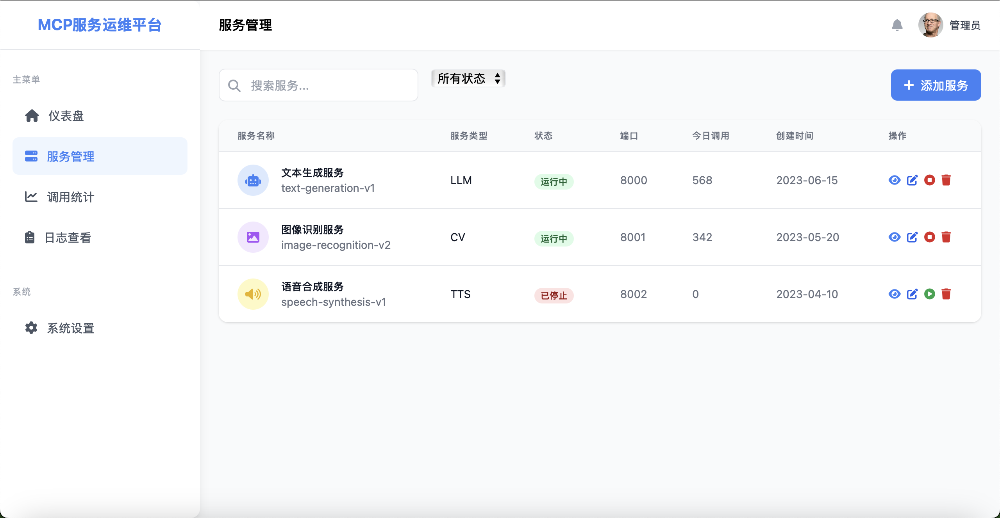

# MCP-Vue 服务运维管理系统

## 项目介绍

MCP-Vue 是一个基于 Vue 3 和 Vite 构建的现代化服务运维管理系统，旨在提供简单高效的服务管理解决方案。该系统允许用户对各类服务进行创建、配置、监控和管理，提高运维效率和服务质量。

## 功能特点

- **服务管理**：创建、编辑、查看和删除服务
- **服务操作**：启动、停止和重启服务
- **状态监控**：实时监控服务运行状态
- **日志查看**：集中查看各服务运行日志
- **数据统计**：服务运行数据可视化展示
- **系统设置**：自定义系统配置参数

## 技术栈

- **前端框架**：Vue 3 (使用 Composition API 和 `<script setup>` 语法)
- **构建工具**：Vite
- **路由管理**：Vue Router
- **UI 框架**：Tailwind CSS
- **图标库**：Font Awesome

## 项目结构

```
mcp-vue/
├── public/           # 静态资源
├── src/
│   ├── assets/       # 项目资源文件
│   ├── components/   # 公共组件
│   ├── router/       # 路由配置
│   ├── views/        # 页面视图组件
│   │   ├── Dashboard.vue     # 仪表盘
│   │   ├── Logs.vue          # 日志查看
│   │   ├── ServiceAdd.vue    # 添加服务
│   │   ├── ServiceDetail.vue # 服务详情
│   │   ├── ServiceEdit.vue   # 编辑服务
│   │   ├── Services.vue      # 服务列表
│   │   ├── Settings.vue      # 系统设置
│   │   └── Statistics.vue    # 数据统计
│   ├── App.vue       # 根组件
│   ├── main.js       # 入口文件
│   └── style.css     # 全局样式
├── index.html        # HTML 模板
├── package.json      # 项目依赖
└── vite.config.js    # Vite 配置
```
## 项目截图




## 安装与使用

### 环境要求

- Node.js 16.0 或更高版本
- npm 7.0 或更高版本

### 安装步骤

1. 克隆项目代码

```bash
git clone <仓库地址>
cd mcp-vue
```

2. 安装依赖

```bash
npm install
```

3. 启动开发服务器

```bash
npm run dev
```

4. 构建生产版本

```bash
npm run build
```

5. 预览生产构建

```bash
npm run preview
```

## 使用指南

### 服务管理

1. **添加服务**：通过「添加服务」页面创建新服务，填写服务名称、类型、路径等信息
2. **查看服务**：在服务列表页查看所有服务及其状态
3. **服务详情**：点击服务卡片查看详细信息，可进行启动、停止、重启等操作
4. **编辑服务**：在服务详情页点击「编辑服务」按钮修改服务配置

### 系统监控

- 通过仪表盘查看系统整体运行状况
- 在统计页面查看各类数据图表和分析
- 在日志页面查看服务运行日志

## 开发指南

### 添加新页面

1. 在 `src/views` 目录下创建新的 Vue 组件
2. 在 `src/router/index.js` 中添加对应路由配置

### 样式开发

项目使用 Tailwind CSS 进行样式开发，可以直接在组件中使用 Tailwind 提供的工具类。

## 贡献指南

欢迎提交问题和功能需求，或直接提交 Pull Request 来改进项目。

## 许可证

[MIT License](LICENSE)
